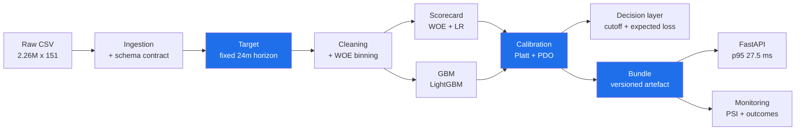
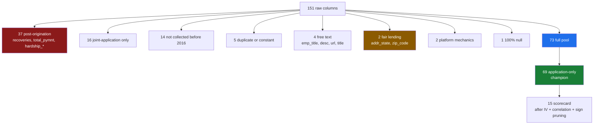

# Credit Risk PD System — Lending Club

[](https://github.com/Nauviii/credit-risk-system-with-AI-agent/actions/workflows/ci.yml)


An end-to-end probability-of-default system built the way a lender would build one: every
decision traceable from business logic through code, measured against an honest baseline, and
tested before it is believed.

The modelling is the smallest part. Most of the work is in the questions a leaderboard never
asks — is the target definition even unbiased, how much of this performance did the model earn
versus inherit, does a predicted PD of 0.12 actually produce 12% defaults, what does the score
cost and earn at a cutoff, and would monitoring have caught the failure that happened.

**Status: complete through monitoring.** 137 tests, CI green, service containerised at
p95 27.5 ms.



---

## Contents

| | | | |
|---|---|---|---|
| [1. Headline results](#1-headline-results) | [5. Target definition](#5-target-definition) | [9. Explainability](#9-explainability) | [13. Serving API](#13-serving-api) |
| [2. Six findings](#2-six-findings-worth-reading) | [6. Modelling](#6-modelling) | [10. Monitoring](#10-monitoring) | [14. Testing and CI](#14-testing-and-ci) |
| [3. Framing](#3-framing-whose-model-is-this) | [7. Calibration](#7-calibration-and-the-point-scale) | [11. Architecture](#11-architecture) | [15. Limitations](#15-limitations) |
| [4. The dataset](#4-the-dataset) | [8. Decision layer](#8-decision-layer) | [12. Quickstart](#12-quickstart) | [16. References](#16-references) |

---

## 1. Headline results

Out-of-time test set: the 2016 vintage, 434,407 loans, 24-month default rate 11.36%.

**The baseline comes first, because a model AUC quoted without one is uninterpretable.**
LendingClub publishes `sub_grade` — its own fitted risk assessment — with every loan.

| Scorer | AUC | 95% CI | Gini |
|---|---|---|---|
| `sub_grade` alone, no model fitted | 0.6889 | [0.6865, 0.6913] | 0.3778 |
| `int_rate` alone | 0.6878 | — | 0.3756 |
| `fico_range_low` alone | 0.5886 | — | 0.1772 |

| Model | Full pool (73 feat.) | Application-only (69 feat.) |
|---|---|---|
| Scorecard (WOE + logistic regression) | 0.7015 / Gini 0.4031 | 0.6665 / Gini 0.3331 |
| GBM (LightGBM, tuned) | 0.7135 / Gini 0.4270 | **0.6964 / Gini 0.3929** ← champion |

Differences tested with DeLong on the same 434,407 loans, so the AUCs are correlated and paired
— an unpaired comparison would overstate the standard error of the difference:

| Comparison | Difference | 95% CI | p |
|---|---|---|---|
| Champion vs `sub_grade` alone | **+0.0076** | [+0.0054, +0.0097] | 5.3 × 10⁻¹² |
| LendingClub grade + rate contribution | **+0.0171** | [+0.0158, +0.0183] | 7.3 × 10⁻¹⁵⁵ |
| GBM over scorecard, application-only | **+0.0299** | [+0.0284, +0.0314] | < 10⁻³⁰⁰ |

> [!IMPORTANT]
> **The honest reading.** Raw application variables beat LendingClub's own grade, and the
> margin is statistically unambiguous. It is also small: +0.0076 AUC is 0.0152 Gini, roughly a
> third of the 0.0462 Gini swing this same model shows across the four quarters of 2016. Real,
> and not large relative to the noise a portfolio actually operates in.

Note also that Scorecard (full) at [0.6992, 0.7039] outperforms the champion and their
intervals do not overlap. The champion is not the best model available — it is the best model
that does not consume another lender's risk output. That is a framing decision, explained next.

---

## 2. Six findings worth reading

**The obvious target definition is biased, and the bias grows with vintage age.** Building
`default_flag` from matured loans only — the standard approach on this dataset — conditions on
a post-origination event. Measured bias between defaults/matured and defaults/issued: 0.0pp in
2013, 1.0pp in 2014, 2.2pp in 2015, **7.6pp in 2016**. A fixed 24-month outcome window removes
it. ([§4](#5-target-definition))

**Most of the model's discrimination is borrowed.** `sub_grade` alone reaches Gini 0.3778 — 88%
of what a tuned 73-feature GBM achieves. Printing that baseline on every run changed which
model became the champion and how the whole project is described. ([§5](#6-modelling))

**Hyperparameters were at their ceiling before tuning started.** Two parameter sets differing
sixfold in regularization (`min_child_samples` 155 vs 948, learning rate 0.0097 vs 0.0373)
produced OOT AUCs of 0.7137 and 0.7145. The train–OOT gap is a boosting fit artefact, not an
overfitting alarm. ([§5](#6-modelling))

**`loan_amnt` is the third most important feature to the GBM and has an IV of 0.0019.** Its
effect is purely interactive — $30,000 is unremarkable against a $200,000 income and dangerous
against $40,000 — so a univariate screen discards it. A concrete mechanism for why the GBM
beats the linear scorecard by +0.0299 once `sub_grade` is removed. ([§8](#9-explainability))

**PSI would have missed the 2016 failure entirely.** Score PSI on that vintage is **0.0007** —
zero for practical purposes — while realised defaults ran 10% above prediction. Distribution
stability and outcome stability are different questions, demonstrated on real data rather than
argued. ([§9](#10-monitoring))

**Discrimination decays inside a single out-of-time year.** Champion Gini by 2016 issue
quarter: 0.4175, 0.3935, 0.3785, 0.3713 — monotone, Q1 and Q4 confidence intervals not
overlapping. The pooled figure averages over a declining trend. ([§5](#6-modelling))

---

## 3. Framing: whose model is this

**Originator.** The system models a lender scoring its own applicants.

This is a decision, not a detail, and it determines the champion. `grade`, `sub_grade`,
`int_rate` and `installment` are LendingClub's own fitted risk output. An originator has no
counterpart to them at decision time, so the champion excludes them. The full-pool model is
kept and reported as a benchmark that measures exactly what those columns add.

The alternative — an investor selecting from listed loans, where `sub_grade` is legitimately
available — was considered and rejected. It also needs a return model (interest income,
recoveries, prepayment), and a PD alone cannot support any decision under it.

`addr_state` and `zip_code` are excluded on **fair-lending** grounds, not statistical ones.
Location is a well-established proxy for protected characteristics. SHAP ranked `addr_state`
ninth by attribution (3.4%) on the champion even though its IV of 0.0135 had already kept it
out of the scorecard — the GBM was using it materially while a univariate screen called it
uninformative. Measured cost of removal: **0.0008 AUC**. This does not make the model neutral;
explicit disparate-impact testing is still required before deployment.

---

## 4. The dataset

**Lending Club Loan Data** — every loan the platform originated between 2007 and 2018Q4.
Source: Kaggle [`wordsforthewise/lending-club`](https://www.kaggle.com/datasets/wordsforthewise/lending-club).

| | |
|---|---|
| Loans | **2,260,668** |
| Raw columns | **151** |
| File size | ~1.6 GB uncompressed |
| Period | 2007 → 2018Q4 |
| Labelled for modelling | **1,225,945** (2013–2016, fully observable at H = 24) |
| Defaults in that population | **127,450** (10.4%) |
| Features surviving to the champion | **69** |

Chosen over Home Credit Default Risk and Amex Default Prediction for two reasons that decided
the whole project. It carries **real origination timestamps**, which makes genuine out-of-time
validation possible rather than a random split pretending to be one. And its features are
**un-anonymised**, so `dti` is debt-to-income and can be argued about, where Amex's `D_/S_/P_/B_`
columns would have made the interpretability and fair-lending work impossible.

### Volume by vintage

Origination grew by three orders of magnitude, and that shape drives several decisions later.

| Vintage | Loans | Share | Role |
|---|---|---|---|
| 2007–2011 | 42,535 | 1.9% | excluded — bureau features not yet collected |
| 2012 | 53,367 | 2.4% | excluded — bureau coverage only partial |
| 2013 | 134,814 | 6.0% | train |
| 2014 | 235,629 | 10.4% | train |
| 2015 | 421,095 | 18.6% | validation, and the calibration vintage |
| 2016 | 434,407 | 19.2% | **out-of-time test** |
| 2017 | 443,579 | 19.6% | drift monitoring only — cannot reach 24 months |
| 2018 | 495,242 | 21.9% | drift monitoring only |

Note that **46% of the data is unusable for supervised evaluation**: the early vintages lack
the features, and 2017–2018 cannot reach the outcome horizon before the data ends. A model
advertised as "trained on 2.26M loans" would be trained on a population it can neither fully
observe nor explain — 1.23M is the honest number, and stating it is part of the point.

### From 151 raw columns to 69 usable features

Feature count is not a virtue, and most of the 151 columns are actively harmful. The funnel:



| Exclusion | Cols | Why it would break the model |
|---|---|---|
| Post-origination | 37 | `recoveries`, `total_pymnt`, `last_fico_range_low`, all `hardship_*` — populated only *after* a borrower is in distress. Including one produces an AUC above 0.95 and a model that predicts the past. |
| Joint application | 16 | `sec_app_*`, `annual_inc_joint` — Joint App only exists from 2017, so these are empty in every modelled vintage. |
| Vintage-dependent | 14 | `il_util`, `open_acc_6m` and others: 95–100% null across the whole train window. |
| Free text | 4 | `emp_title`, `desc`, `title`, `url` — unusable without NLP; `emp_title` alone runs to hundreds of thousands of distinct values. |
| **Fair lending** | 2 | `addr_state`, `zip_code` — proxies for protected characteristics. Excluded on compliance grounds, at a measured cost of 0.0008 AUC. |
| Duplicate / constant | 5 | `funded_amnt` is `loan_amnt`, `fico_range_high` is `fico_range_low` + 4, `policy_code` never varies. |
| Platform mechanics | 2 | `initial_list_status`, `disbursement_method` — how LendingClub funded the loan, not who the borrower is. |
| Always null | 1 | `member_id` |
| **Lender-derived** | 4 | `grade`, `sub_grade`, `int_rate`, `installment` — held out of the champion but kept as the benchmark that measures what they add ([§3](#3-framing-whose-model-is-this)). |

<details>
<summary><b>Data-quality findings that required a decision</b> (click to expand)</summary>

- **Junk rows.** The raw file concatenates LendingClub's quarterly exports, so summary lines
  ("Total amount funded in policy code 1: ...") land in the `id` column. Handled by reading
  `id` as string and filtering to numeric-only values.
- **`dti` has a sentinel of 999** against a realistic 0–40 range. Nulled before binning; left
  in, it becomes the strongest bin in the feature.
- **`annual_inc` reports a maximum of $61,000,000** against a p99.9 of $600,000. Winsorized at
  p99.5 ($350,000).
- **Six `mths_since_*` columns where missing means "never happened"**, not "unknown". Mean
  imputation would invent a delinquency history; they get explicit `has_*` flags instead.
- **Two separate vintage-dependent bureau groups**, not one. LendingClub expanded collection in
  stages: one group is unusable across the entire train window and is dropped; a second becomes
  available from 2013 and drives the train window start ([§5](#6-modelling)).

</details>

## 5. Target definition

### The censoring problem

The standard target on this dataset is "Charged Off = 1, Fully Paid = 0, drop everything else".
That drops loans still performing, which conditions the sample on an outcome. The consequence
is that measured default rate becomes a function of how old a vintage is:

| Vintage | % censored | defaults / matured | defaults / issued | gap |
|---|---|---|---|---|
| 2013 | 0.0% | 0.1560 | 0.1559 | 0.0pp |
| 2014 | 5.3% | 0.1845 | 0.1747 | 1.0pp |
| 2015 | 10.8% | 0.2019 | 0.1800 | 2.2pp |
| 2016 | 32.5% | 0.2329 | 0.1571 | **7.6pp** |
| 2017 | 61.8% | 0.2313 | 0.0883 | 14.3pp |

Under that definition the 2016 out-of-time set looked far worse than train and the natural
conclusion was severe drift. Roughly a third of it was an artefact of the definition. The 2017
row shows where it ends up: a 14.3pp gap, at which point the "matured" subset is almost
entirely fast-resolving loans and the measured rate says more about the calendar than about
credit. Full table in [`docs/vintage_censoring.csv`](docs/vintage_censoring.csv).

### Fixed outcome window

```yaml
target:
  definition: fixed_horizon
  horizon_months: 24          # largest H under which 2016 is fully observable
  charge_off_lag_months: 5    # LendingClub charges off at ~121 days delinquent
  data_cutoff: "2018-12"
  bad_statuses: ["Charged Off", "Default"]
```

Every loan old enough to be observed for H months gets a label. Nothing is dropped for being
healthy, the definition means the same thing in every vintage, and default rates become
directly comparable.

**Cost of H = 24**, measured on the fully matured 2013 vintage: it captures 60.1% of eventual
36-month defaults and 43.7% of 60-month ones. Identical across every split, so it shifts the
level but not the comparison. Carried downstream — this is a 24-month PD, and the asymmetry
between terms must be corrected before any expected-loss calculation ([§7](#8-decision-layer)).

**The charge-off timing proxy is validated, not assumed.** `last_pymnt_d + 5` was checked on
2012–2013: the median gap between months-to-last-payment and payments-actually-made is 0.000
for loans without recoveries and 0.012 for loans with them. `last_pymnt_d` marks the true final
scheduled payment and is not moved by post-charge-off collections.

### Splits

| Split | Window | n | 24-month default rate |
|---|---|---|---|
| train | 2013-01 – 2014-12 | 370,443 | 0.0892 |
| validation | 2015 | 421,095 | 0.1070 |
| oot_test | 2016 | 434,407 | 0.1136 |

**Train starts in 2013 for a measured reason.** Seven candidate bureau features
(`acc_open_past_24mths`, `mort_acc`, `avg_cur_bal`, `bc_open_to_buy` and three more) are 100%
null before 2012 and drop below 5% only from 2013. Keeping earlier vintages puts 96,502 rows —
21% of the old train set — into a WOE `missing` bin that encodes calendar time rather than
credit risk, and that bin never fires at validation or serving time.

2017–2018 cannot reach 24 months of observation before the cutoff. Reserved for drift
simulation, never for labels.

---

## 6. Modelling

### Feature engineering

WOE binning with three rules enforced rather than assumed, all auditable via
`WOEEncoder.binning_report()`:

- **Haldane–Anscombe smoothing at count level.** An earlier proportion-level epsilon of 1e-6
  produced WOE up to +13 for a zero-bad bin, which then dominated the logistic fit.
- **Monotonic bad rate** across ordered bins, adjacent violations merged.
- **Minimum bin size** by population share (5%) and absolute counts (30 bads, 30 goods).
  Categorical pooling is keyed on class counts, never on population share.

A permanent sanity check: **IV(`sub_grade`) must exceed IV(`grade`)**. A finer partition cannot
carry less information, and the reverse was the signature of a pooling bug that collapsed all
35 `sub_grade` levels into one bin.

### The two feature sets, and the absence that matters

`SCORECARD_FEATURES` (14) and `APPLICATION_FEATURES` (15) are derived reproducibly in
`notebooks/feature_selection_scorecard.ipynb`: IV ≥ 0.02 → drop single-bin features → pairwise
correlation prune at 0.6 → iterative sign-based refinement.

**`term_months` is absent from the full list and is the strongest feature in the
application-only list (coefficient −1.05).** Term is one of the most fundamental risk drivers in
installment lending. It disappears from the full model because `sub_grade` already prices it —
LendingClub charges more for 60-month loans — so it carries no independent signal once
`sub_grade` is present. The gap between the two lists is a direct measurement of how much of the
"full" scorecard is really LendingClub's scorecard.

### Tuning: stop

| | `min_child_samples` | learning rate | best iteration | train AUC | OOT AUC |
|---|---|---|---|---|---|
| Tuned on the old biased target | 155 | 0.0097 | 1911 / 2000 | 0.7730 | 0.7137 |
| Retuned, protocol fixed | 948 | 0.0373 | 448 / 4000 | 0.7823 | **0.7145** |

Regularization tightened sixfold; generalisation moved 0.0008. What is diagnostic is whether
OOT improves under regularization, and it does not. The widened train–OOT gap is boosting
fitting its training data, not a defect.

The tuning protocol was still fixed: early stopping now runs on an inner temporal slice of
train (2014-10 onward), and 2015 is scored once per trial and used for nothing else. The
previous version used 2015 for both, letting every trial stop where its own score looked best.

### Stability

Per-term OOT AUC is effectively identical (36-month 0.6934, 60-month 0.6924), so **segmented
models are not warranted** — the term asymmetry is a calibration problem, not a ranking one.

Per-quarter Gini is not identical:

| Quarter | n | Gini | 95% CI |
|---|---|---|---|
| 2016Q1 | 133,887 | 0.4175 | [0.4091, 0.4258] |
| 2016Q2 | 97,854 | 0.3935 | [0.3836, 0.4034] |
| 2016Q3 | 99,120 | 0.3785 | [0.3686, 0.3884] |
| 2016Q4 | 103,546 | 0.3713 | [0.3612, 0.3814] |

An 11% loss of Gini across four quarters, monotone, with non-overlapping Q1/Q4 intervals. The
pooled 0.3929 overstates the model's state at the end of the period.

---

## 7. Calibration and the point scale

Discrimination only cares about ranking. Expected loss, pricing, provisioning and cutoffs all
need the level to be right, and a model can rank perfectly while being systematically wrong
about magnitude.

**Uncalibrated, the champion is systematically optimistic.** Mean predicted PD on OOT is 0.0892
— exactly train's base rate — against an actual 0.1136. All ten reliability bins run negative.
ECE 0.0244.

**Brier decomposition isolates the problem**, `brier = reliability − resolution + uncertainty`:

| | validation | oot_test |
|---|---|---|
| reliability (calibration error) | 0.00023 | **0.00074** |
| resolution (discrimination) | 0.00505 | **0.00506** |
| uncertainty (base-rate variance) | 0.09554 | 0.10066 |

Resolution is identical. Only reliability worsens. The problem is purely level, which is what
calibration fixes. Note also that uncertainty is ~95% of the total Brier score — a raw Brier
number on this data is almost entirely base-rate variance and useless for comparing models
across populations.

**Platt, not isotonic**, fitted on validation and applied to OOT:

| | ECE | AUC | min PD | distinct values |
|---|---|---|---|---|
| Platt | 0.0118 | 0.6972 | 3.6e-03 | 434,407 |
| Isotonic | 0.0117 | 0.6970 | 1.0e-04 (floor) | **212** |
| Uncalibrated | 0.0244 | 0.6972 | — | — |

Isotonic's 0.0001 ECE advantage is noise. It collapsed 434,407 predictions onto 212 levels and
assigned **PD exactly 0** to a block of loans, six of which defaulted. A PD of zero implies
infinite odds, zeroes expected loss and sends the point score to its clipping bound.

Residual after calibration: mean PD 0.1017 against an actual 0.1136. That is correct behaviour
— the calibrator was fitted on 2015 and cannot anticipate 2015→2016 drift. It is the argument
for scheduled recalibration.

**Score scale.** PDO 20, base 600 points at 50:1 odds, range 473–649. Verified against data:
bad rate by band runs 0.0324 → 0.0640 → 0.1163 → 0.1927 → 0.2999, giving odds ratios of 2.04,
1.92, 1.81, 1.79 — the doubling every 20 points the scale promises.

---

## 8. Decision layer

A PD model that stops at AUC has not answered a business question.

**LGD is estimated, not assumed.** From 221,290 charged-off loans, exposure-weighted LGD =
**0.882**; collections return roughly 12% of outstanding principal.

**Lifetime PD**, from horizon coverage measured on the fully matured 2013 vintage:

| Term | Coverage at 24m | PD (24-month) | PD (lifetime) |
|---|---|---|---|
| 36 | 0.6011 | 0.0941 | 0.1566 |
| 60 | 0.4372 | 0.1299 | 0.2968 |

The term risk ratio is 1.380 on a 24-month basis but **1.895 on a lifetime basis** — a single
blended factor understates 60-month exposure by a factor of 1.37.

**Cutoff economics** (OOT, `net_margin_rate = gross_yield × (1 − PD) − expected_loss_rate`):

| Approval | Bad rate | Expected loss | Gross yield | Net margin | Total margin | Marginal |
|---|---|---|---|---|---|---|
| 25% | 3.67% | 5.29% | 17.54% | 11.06% | $176M | +11.82% |
| 35% | 4.53% | 6.47% | 19.24% | **11.16%** | $248M | +11.27% |
| 50% | 5.75% | 8.21% | 21.38% | 10.87% | $343M | +9.43% |
| 80% | 8.47% | 12.41% | 25.41% | 8.71% | **$439M** | **+0.57%** |
| 85% | 9.03% | 13.34% | 26.15% | 8.02% | $430M | −2.75% |
| 100% | 11.36% | 18.07% | 29.42% | 3.40% | $218M | −36.89% |

**Picking the wrong column picks the wrong cutoff.** Maximising margin *rate* lands at 35%
approval and leaves **$191M** on the table; a lender with capital to deploy maximises currency,
which peaks at 80%. The decisive column is marginal margin — what the tranche added by loosening
actually earns. It crosses zero between 80% and 85%, at which point the *average* margin is
still a healthy 8.71% while each additional approval has stopped adding value.

**Risk-based pricing does most of the work.** Gross yield rises monotonically as the cutoff
loosens (12.06% → 29.42%) because LendingClub charges more to riskier borrowers, and margin
stays positive even at 100% approval. So the bad-rate curve overstates the model's value: bad
rate halves between 100% and 50% approval while total margin *falls* from its peak. The model's
real contribution is finding mispricing relative to grade, not screening out bad loans —
consistent with the champion beating `sub_grade` by only +0.0076 AUC.

---

## 9. Explainability

SHAP on the champion (application-only), computed on 20,000 sampled OOT rows.

**All nine direction checks pass.** `dti` raises risk (ρ = +0.979), `annual_inc` lowers it
(−0.980), `fico_range_low` lowers it (−0.981). Near-perfectly monotone on the top three, so
these are not weak tendencies.

**Attribution is diffuse**: top 5 features = 31.7%, top 15 = 64.1%. Good for robustness, and it
carries an operational cost that belongs in the serving decision — 69 features must be computed
and validated per request to buy +0.0076 AUC over a single column.

**Where the GBM earns its lift.** SHAP versus IV rank agreement is Spearman 0.834; the
interesting part is the exceptions:

| Feature | SHAP share | IV |
|---|---|---|
| `loan_amnt` | **6.4%** | 0.0019 |
| `addr_state` | 3.4% | 0.0135 |
| `total_il_high_credit_limit` | 2.3% | 0.0019 |
| `pct_tl_nvr_dlq` | 2.1% | 0.0017 |

The scorecard has no capacity-to-repay feature. A `loan_amnt / annual_inc` ratio is pure
application data, is exactly the interaction the GBM exploits, and is readable by a credit
committee — the most promising route to closing part of the 0.0299 gap. Not implemented; it
reopens feature selection.

**The scorecard as a points table.** `points(feature, bin) = −factor × coefficient × WOE +
(offset − factor × intercept) / n`, with `factor = PDO / ln 2`. Ranked by swing — the points
difference between a feature's worst and best bin, which is what actually moves a score:

| Feature | Swing | Bins |
|---|---|---|
| `purpose` | 22.1 | 13 |
| `acc_open_past_24mths` | 16.3 | 8 |
| `annual_inc` | 16.0 | 11 |
| `fico_range_low` | 14.4 | 12 |
| `term_months` | 12.7 | 2 |

Agreement with the GBM's SHAP ranking: Spearman 0.725. Both models read the population broadly
the same way.

---

## 10. Monitoring

Three questions, three instruments, and the project demonstrates that none substitutes for
another.

**Distribution drift** — answerable immediately, no outcome needed. Bin edges are frozen inside
the model bundle at build time; re-deriving a reference from live data would compare a
population to itself.

| Population | Score PSI | Band |
|---|---|---|
| 2017 (443,579 loans) | 0.0111 | stable |
| 2018 (495,242 loans) | 0.0292 | stable |
| oot_test (2016) | **0.0007** | stable |

Feature drift on 2018 is a different story: `percent_bc_gt_75` 0.336, `bc_util` 0.308,
`revol_util` 0.296, `bc_open_to_buy` 0.254 — all material, all roughly doubled since 2017. The
borrower population genuinely moved on revolving utilisation.

> [!WARNING]
> **And the score did not move.** Four inputs at material shift produced a score PSI of
> 0.0292. Those four carry roughly 7% of SHAP attribution between them, and attribution is
> diffuse, so no single input can move the score alone. **Score PSI alone would also have
> missed this** — which is why the monitoring set needs all three layers.

**Outcome performance** — the check PSI structurally cannot perform:

| Vintage | Expected | Actual | Ratio | z | Band |
|---|---|---|---|---|---|
| 2013 | 13,107 | 11,220 | 0.856 | −17.8 | material |
| 2014 | 24,594 | 21,835 | 0.888 | −19.1 | material |
| 2015 | 45,053 | 45,051 | **1.0000** | −0.01 | stable |
| 2016 | 44,215 | 49,327 | **1.116** | +26.4 | material |

2015 lands at 0.99997 because it is the vintage the calibrator was fitted on — the strongest
available check that calibration works. Deviation on other vintages is **deviation from the
calibration baseline, not from truth**, and it sets a recalibration cadence: one year after
fitting, 2016 already deviates 11.6%.

Defaults are Poisson-binomial (independent Bernoulli with *different* probabilities), so
variance is Σp(1−p); a pooled rate would overstate it and hide real deterioration. And
significance is not materiality — on 400,000 loans a 1.4% deviation reaches z = −3.3. An alert
requires both.

**Early warning** — a verdict 19 months before the outcome window closes. Scaling the
expectation by hazard coverage lets a six-month-old cohort be judged:

| MOB | Coverage | Expected | Actual | Ratio | z |
|---|---|---|---|---|---|
| 6 | 0.023 | 1,035 | 1,171 | 1.131 | 4.2 |
| 12 | 0.260 | 11,674 | 14,265 | 1.222 | 24.5 |
| 18 | 0.640 | 28,716 | 33,051 | 1.151 | 26.9 |
| 24 | 1.000 | 44,855 | 49,327 | 1.100 | 22.9 |

**Earliest alerting month on book: 5.** The ratio holds between 1.10 and 1.22 at every
observation point, so this is a stable deterioration signal rather than an artefact.

A third signal is missing and identified: discrimination itself decayed through 2016
([§5](#6-modelling)), and neither instrument tracks that. `gini_by_period` computes it and is
not yet wired into the monitoring pass.

---

## 11. Architecture

Core principle: **analysis that decides something lives in a notebook; production code consumes
the decision and never re-derives it at runtime.**

```
src/credit_risk/
  data/
    schema.py         all exclusion/cleaning decisions as named constants
    ingestion.py      Polars raw CSV loader, junk-row fix
    target.py         fixed-horizon label + observability filter
    diagnostics.py    vintage censoring, feature availability, hazard, proxy validation
  features/
    cleaning.py       sentinels, winsorize, term/credit-history parsing, has_history flags
    woe.py            WOEEncoder (monotonic binning, count smoothing, binning_report)
    build_dataset.py  feature matrix, splits, the two derived feature lists
  models/
    scorecard.py      WOE + logistic regression
    gbm.py            LightGBM
  evaluation/
    metrics.py        auc, gini, ks
    baselines.py      single-feature AUC floors, per-vintage and per-segment decomposition
    significance.py   DeLong paired AUC test, confidence intervals, per-period Gini
    diagnostics.py    coefficient signs, multicollinearity, sign-based refinement
    stability.py      PSI with frozen reference profiles
    calibration.py    reliability, ECE, Brier decomposition, Platt, PDO scaling
    business.py       approval curve, lifetime PD, empirical LGD, cutoff economics
  explainability/
    attribution.py    SHAP aggregation and direction, scorecard points table
  serving/
    artifacts.py      versioned model bundle: save, load, predict
    schema.py         request contract derived from the bundle
    app.py            FastAPI service
  monitoring/
    drift.py          PSI against the bundle's frozen reference
    performance.py    expected vs actual, early warning

scripts/
  train_baseline.py     trains all four models, prints baselines + significance
  tune_gbm.py           Optuna, per pool, separate params files
  build_artifacts.py    trains the champion and writes a servable bundle
  benchmark_serving.py  latency percentiles

notebooks/    vintage_diagnostics, feature_selection_scorecard, evaluation_phase5,
              decision_layer, explainability, monitoring_simulation
configs/      base.yaml — every value documented with the evidence behind it
docs/         five findings documents plus the CSV evidence behind each decision
```

**Engineering notes.** Polars for all loading and transforms at 2.26M rows, converting to pandas
only at the sklearn/LightGBM/SHAP boundary. `uv` with a PEP 621 `pyproject.toml`. Ruff and Black
pinned in `pyproject.toml` so CI and a developer machine cannot disagree.

**The WOE sign convention is not a bug.** `WOE = ln(dist_good / dist_bad)`, so higher means
safer, and a model predicting P(default = 1) must show *negative* coefficients. Positive is the
anomaly, and the pruning steps exist to catch it.

---

## 12. Quickstart

```bash
uv sync --all-groups
uv run pytest tests/ -v                                    # 137 passed
```

Place `accepted_2007_to_2018Q4.csv` in `data/raw/`, then:

```bash
# Train and evaluate all four models, with baselines and significance tests
uv run python scripts/train_baseline.py --input data/raw/accepted_2007_to_2018Q4.csv

# Optional: retune (50 trials per pool)
uv run python scripts/tune_gbm.py --input data/raw/accepted_2007_to_2018Q4.csv --pool application

# Build a servable bundle
uv run python scripts/build_artifacts.py --input data/raw/accepted_2007_to_2018Q4.csv

# Serve
uv run uvicorn credit_risk.serving.app:app --reload        # http://localhost:8000/docs
```

Docker:

```bash
docker build -t credit-risk-system:local .
docker run -p 8000:8000 -v ./artifacts:/app/artifacts:ro credit-risk-system:local
```

Artefacts are deliberately **not** baked into the image. A bundle is a few MB and changes on
every retrain, while the image changes on every code change; baking them together forces a
rebuild for each and makes it impossible to tell which model an image is serving.

---

## 13. Serving API

| Endpoint | Purpose |
|---|---|
| `GET /health` | Liveness only. Does not assert the model is usable. |
| `GET /ready` | Readiness — model loaded. This is what a load balancer polls. |
| `GET /model` | Full provenance: dataset hash, config hash, split sizes, OOT metrics, required fields. |
| `POST /score` | One application → calibrated PD, point score, model version, input completeness. |
| `POST /score/batch` | Up to 1,000 applications in one model call. |

**The API accepts raw application fields, not model features.** Asking a client to send
`term_months`, `credit_history_months` and the `has_*` flags would push feature engineering
across the network boundary — the textbook source of training/serving skew. The service runs the
same `clean_features` the training path runs, and the required field list is computed from the
loaded bundle so it cannot fall out of sync with the model.

**Completeness is enforced.** An empty payload used to return a plausible PD near the base rate
— the model's "everything unknown" prediction — which in credit decisioning is far worse than a
rejected request. Core fields (`loan_amnt`, `annual_inc`, `dti`, `fico_range_low`, `term`,
`issue_d`, `earliest_cr_line`) must be present and non-null, and at least half the model's
required fields supplied. A missing *bureau* field is still scored as null, because a pull that
genuinely failed is a real production case.

**Latency**, measured over 500 warm in-process requests:

| | p50 | p95 | p99 |
|---|---|---|---|
| `/score` | 25.1 ms | **27.5 ms** | 29.5 ms |
| `/score/batch` (100) | 122.4 ms | 132.9 ms | — |

Per application in batch: 1.22 ms, a 20.5× speedup. Decomposing the two gives ~0.98 ms per row
and ~24 ms fixed per request — the model itself is nearly free; the cost is frame construction,
cleaning and the HTTP stack.

---

## 14. Testing and CI

137 tests. The ones worth knowing about are the guards, not the happy paths:

- **Anti-leakage**: post-origination, platform, label-timing and geographic columns can never
  reach any feature list.
- **Bundle round-trip**: a loaded bundle must reproduce the fitted model's predictions exactly,
  including under shuffled column order and single-row requests.
- **Calibrator**: never returns a PD of exactly 0 or 1; Platt preserves ranking exactly.
- **WOE**: a 35-level ordinal must not be pooled away, and its IV must exceed its coarser
  parent's — the check that catches the class of bug that caused it once.
- **Monitoring**: a reference on the wrong quantity is named as a mismatch, not reported as
  drift; early warning does not count loans that merely resolved early.
- **DeLong**: AUC must match scikit-learn to 1e-9 including under heavy ties, and the paired
  standard error must be smaller than treating the AUCs as independent.

CI runs lint, format check, tests, and a Docker build with an import smoke test. It deliberately
does **not** train a model — the dataset is not in the repo, so CI verifies the code is correct,
not that the numbers reproduce.

---

## 15. Limitations

Stated, not hidden.

1. **No reject inference.** Everything is measured on LendingClub's *accepted* population.
   "Approve 80%" means 80% of applicants the platform already accepted. Bad rates are valid;
   approval rates are not readable as real-world acceptance policy.
2. **Prepayment is not modelled.** Net margin assumes scheduled interest with only a `(1 − PD)`
   haircut. Roughly half of borrowers prepay, truncating interest on the *good* loans — which is
   where loose cutoffs get their margin. The true optimum is tighter than 80%.
3. **24-month PD, not lifetime**, corrected by a single factor per term. High-risk borrowers
   default earlier, so their lifetime PD is over-scaled. A discrete-time hazard model is the
   proper fix.
4. **LGD is one portfolio constant** where it genuinely varies by term and grade.
5. **Long-run central tendency uses three vintages**, which is not a credit cycle.
6. **One OOT vintage**, which ran materially worse than train and degraded within itself.
7. **Tuning still touches 2015 twice** — as the Optuna objective across 50 trials and as the
   early-stopping set for the final model. OOT 2016 is untouched, which is what protects the
   headline number.
8. **Discrimination is not monitored**, and 2016 shows it can decay while both existing
   instruments look explainable.
9. **No alerting infrastructure**; monitoring is tested functions and a simulation.
10. **Serving has no authentication, rate limiting or request logging.** Correct and fast, not
    hardened.

> [!NOTE]
> An agent/LLM layer was scoped and **deliberately dropped**. The candidate use cases — adverse
> action notices, monitoring triage, model cards — are all better served deterministically: a
> fixed reason-code table is more auditable than generated prose on a legally consequential
> document, and the PD path's 27.5 ms p95 cannot absorb an LLM call.

---

## 16. References

<details>
<summary><b>Papers and standards this project leans on</b></summary>

- DeLong, DeLong & Clarke-Pearson (1988), *Comparing the areas under two or more correlated ROC
  curves*. Biometrics 44(3).
- Sun & Xu (2014), *A fast implementation of the DeLong algorithm*. IEEE Signal Processing
  Letters 21(11).
- Siddiqi (2017), *Credit Risk Scorecards*, 2nd ed. — monotonic binning, minimum bin size, PDO
  scaling, reject inference.
- Basel Committee, BCBS 128 §452 — default definition and the 12-month PD convention.
- Zhang & Thomas (2012), *Comparisons of linear regression and survival analysis in behavioural
  scoring* — bias from an uncontrolled outcome window.
- Lundberg & Lee (2017), *A unified approach to interpreting model predictions* (SHAP).

</details>

Full technical detail, including every intermediate finding and the bugs corrected along the
way, is in [`PROJECT_HANDOFF.md`](PROJECT_HANDOFF.md) and the five documents in
[`docs/`](docs/).